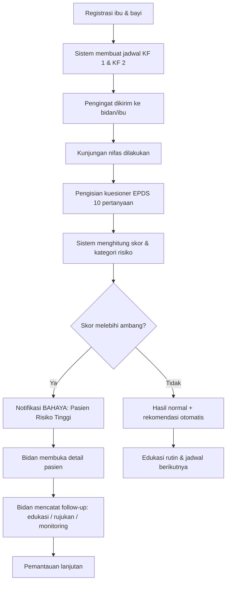
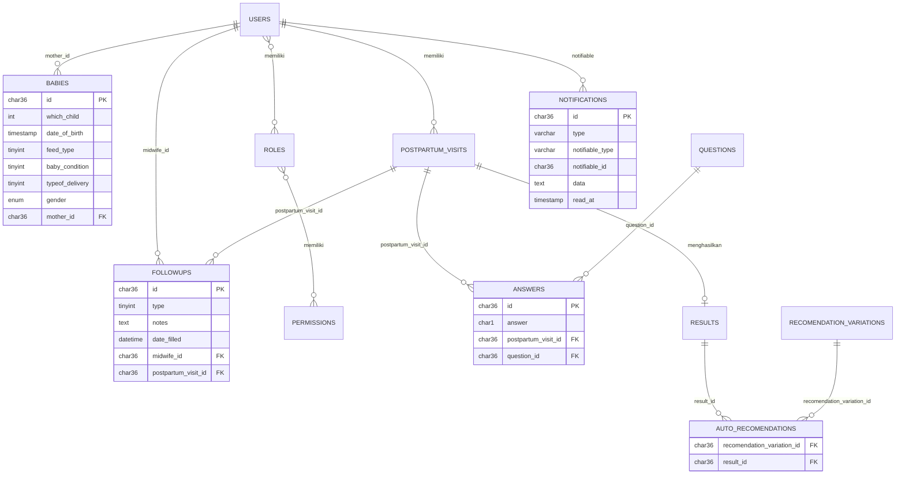

# Product Requirements Document (PRD)
## Aplikasi Skrining EPDS (Edinburgh Postnatal Depression Scale)

| Atribut | Detail |
|---|---|
| **Versi Dokumen** | 2.0 (Draft Komprehensif) |
| **Status** | Draft untuk review |
| **Platform** | Web App (Laravel / PHP) |
| **Pengguna Utama** | Bidan / Tenaga Kesehatan, Ibu Nifas |
| **Basis Dokumen** | PRD v1.0 dan skema database yang ada saat ini |

> **Catatan:** Bagian bertanda **[Asumsi]** adalah usulan yang belum ada di dokumen awal dan perlu divalidasi oleh pemilik produk serta tenaga klinis. Bagian bertanda **[Temuan]** adalah celah atau inkonsistensi yang ditemukan pada desain saat ini.

---

## Daftar Isi

1. [Ringkasan Eksekutif](#1-ringkasan-eksekutif)
2. [Latar Belakang & Masalah](#2-latar-belakang--masalah)
3. [Tujuan, Sasaran, dan Metrik Keberhasilan](#3-tujuan-sasaran-dan-metrik-keberhasilan)
4. [Ruang Lingkup](#4-ruang-lingkup)
5. [Persona & Peran Pengguna](#5-persona--peran-pengguna)
6. [User Journey & Alur Utama](#6-user-journey--alur-utama)
7. [Kebutuhan Fungsional](#7-kebutuhan-fungsional)
8. [Logika Bisnis EPDS](#8-logika-bisnis-epds)
9. [Kebutuhan Non-Fungsional](#9-kebutuhan-non-fungsional)
10. [Arsitektur & Desain Data](#10-arsitektur--desain-data)
11. [Desain Notifikasi](#11-desain-notifikasi)
12. [Kebutuhan UI/UX](#12-kebutuhan-uiux)
13. [Keamanan, Privasi, & Kepatuhan](#13-keamanan-privasi--kepatuhan)
14. [Strategi Pengujian](#14-strategi-pengujian)
15. [Rencana Rilis & Roadmap](#15-rencana-rilis--roadmap)
16. [Risiko & Mitigasi](#16-risiko--mitigasi)
17. [Asumsi, Dependensi, & Pertanyaan Terbuka](#17-asumsi-dependensi--pertanyaan-terbuka)
18. [Glosarium](#18-glosarium)

---

## 1. Ringkasan Eksekutif

Aplikasi Skrining EPDS adalah platform kesehatan digital untuk memantau kesehatan fisik dan mental **ibu nifas beserta bayinya**. Inti sistem adalah skrining depresi postpartum menggunakan *Edinburgh Postnatal Depression Scale* (EPDS). Aplikasi membantu bidan untuk:

- menjadwalkan dan mengingatkan **Kunjungan Nifas (KF 1 dan KF 2)**,
- mengisi dan menghitung skor EPDS secara otomatis,
- menerima **peringatan dini** untuk pasien berisiko tinggi,
- mendokumentasikan **tindak lanjut** (edukasi, rujukan psikologis, monitoring) secara terpusat,
- mencatat data bayi dan riwayat persalinan.

---

## 2. Latar Belakang & Masalah

### 2.1 Latar Belakang
Depresi postpartum sering tidak terdeteksi karena gejalanya dianggap sebagai "baby blues" biasa, dan fokus kunjungan nifas cenderung pada kondisi fisik. Skrining EPDS adalah instrumen tervalidasi yang singkat (10 pertanyaan) dan cocok digunakan oleh bidan di layanan primer.

### 2.2 Masalah yang Ingin Diselesaikan

| # | Masalah | Dampak |
|---|---|---|
| P1 | Skrining EPDS manual (kertas) rawan salah hitung dan terlambat direkap | Pasien berisiko tinggi terlewat |
| P2 | Tidak ada peringatan otomatis saat skor tinggi | Penanganan terlambat |
| P3 | Jadwal KF dikelola manual | Kunjungan terlewat |
| P4 | Tindak lanjut tidak terdokumentasi terstruktur | Tidak ada kesinambungan perawatan dan sulit diaudit |
| P5 | Data ibu, bayi, dan skrining tersebar | Sulit melihat gambaran pasien secara utuh |

---

## 3. Tujuan, Sasaran, dan Metrik Keberhasilan

### 3.1 Tujuan Produk
1. Menyediakan skrining EPDS yang **akurat, terstandar, dan cepat**.
2. Memastikan pasien berisiko tinggi **teridentifikasi dan ditindaklanjuti** tepat waktu.
3. Meningkatkan **kepatuhan kunjungan nifas** melalui pengingat otomatis.
4. Menyediakan **dokumentasi klinis terpusat** yang dapat ditelusuri.

### 3.2 Metrik Keberhasilan (KPI) **[Asumsi: target perlu disepakati]**

| KPI | Definisi | Target Awal |
|---|---|---|
| Cakupan skrining | % ibu nifas terdaftar yang menyelesaikan EPDS pada kunjungan terjadwal | ≥ 90% |
| Waktu ke tindak lanjut | Median waktu dari skor berisiko tinggi hingga follow-up pertama tercatat | ≤ 24 jam |
| Tingkat tindak lanjut | % kasus risiko tinggi yang memiliki minimal 1 follow-up | 100% |
| Kepatuhan kunjungan | % KF 1 dan KF 2 yang terlaksana sesuai jadwal | ≥ 85% |
| Akurasi skor | Selisih skor sistem vs. hitung manual (sampel audit) | 0 kesalahan |
| Waktu pengisian | Rata-rata durasi pengisian EPDS | ≤ 5 menit |
| Adopsi bidan | % bidan aktif mingguan dari total bidan terdaftar | ≥ 80% |

### 3.3 Non-Tujuan
- Aplikasi **bukan alat diagnosis**. EPDS adalah alat skrining; diagnosis tetap oleh tenaga profesional.
- Tidak menggantikan rekam medis elektronik (RME) fasilitas kesehatan.

---

## 4. Ruang Lingkup

### 4.1 Dalam Lingkup (In Scope)
- Manajemen akun & peran (RBAC)
- Registrasi ibu nifas dan data bayi
- Penjadwalan KF 1 dan KF 2 beserta pengingat
- Kuesioner EPDS dan perhitungan skor otomatis
- Peringatan dini risiko tinggi
- Rekomendasi otomatis berdasarkan hasil
- Manajemen follow-up (edukasi, rujukan, monitoring)
- Notifikasi dalam aplikasi
- Dasbor dan riwayat pasien

### 4.2 Di Luar Lingkup Rilis Awal (Out of Scope)
- Integrasi dengan SATUSEHAT / RME eksternal **[Asumsi: fase lanjut]**
- Telekonseling / video call
- Aplikasi mobile native
- Skrining untuk ayah / pasangan
- Pembayaran atau klaim BPJS

---

## 5. Persona & Peran Pengguna

### 5.1 Persona

**Persona A: Bidan (Pengguna Utama)**
- Bertugas di puskesmas / praktik mandiri, menangani banyak pasien nifas.
- *Kebutuhan:* alur cepat, daftar pasien prioritas, peringatan jelas, pencatatan follow-up ringkas.
- *Kendala:* waktu terbatas, kadang koneksi internet tidak stabil.

**Persona B: Ibu Nifas (Subjek Skrining)**
- Usia reproduktif, 0–6 minggu postpartum, kondisi emosional dan fisik rentan.
- *Kebutuhan:* kuesioner mudah dipahami, bahasa empatik, privasi terjaga.
- *Kendala:* kelelahan, literasi digital bervariasi.

**Persona C: Administrator / Koordinator Fasilitas**
- Mengelola akun bidan, memantau kinerja dan cakupan skrining.

### 5.2 Matriks Peran & Hak Akses (RBAC) **[Asumsi]**

| Fitur | Ibu Nifas | Bidan | Admin |
|---|:--:|:--:|:--:|
| Mengisi kuesioner EPDS | ✅ (mode mandiri) | ✅ (mendampingi) | ❌ |
| Melihat hasil skor | ✅ (versi ramah) | ✅ (lengkap) | ✅ (agregat) |
| Menerima peringatan bahaya | ❌ | ✅ | ✅ (ringkasan) |
| Mencatat follow-up | ❌ | ✅ | ❌ |
| Mengelola data bayi | ❌ | ✅ | ❌ |
| Mengelola jadwal KF | ❌ | ✅ | ✅ |
| Mengelola pengguna & role | ❌ | ❌ | ✅ |
| Melihat laporan/statistik | ❌ | ✅ (pasien sendiri) | ✅ (seluruh fasilitas) |
| Melihat audit log | ❌ | ❌ | ✅ |

---

## 6. User Journey & Alur Utama

### 6.1 Alur Skrining Hingga Tindak Lanjut



### 6.2 Skenario Pengguna (User Stories Utama)

| ID | Sebagai | Saya ingin | Agar |
|---|---|---|---|
| US-01 | Bidan | mendaftarkan ibu nifas dan data bayinya | seluruh data tersimpan terpusat |
| US-02 | Bidan | melihat jadwal KF 1 dan KF 2 pasien | tidak ada kunjungan terlewat |
| US-03 | Bidan | mengisi/mendampingi pengisian EPDS | skor dihitung otomatis tanpa salah |
| US-04 | Bidan | menerima peringatan saat skor tinggi | dapat segera bertindak |
| US-05 | Bidan | mencatat tindakan follow-up | ada dokumentasi kesinambungan perawatan |
| US-06 | Ibu nifas | mengisi kuesioner dengan bahasa jelas | saya dapat jujur menjawab dengan nyaman |
| US-07 | Admin | melihat statistik skrining & tindak lanjut | memantau kualitas layanan |
| US-08 | Bidan | melihat riwayat skor antar kunjungan | memantau tren kondisi pasien |

---

## 7. Kebutuhan Fungsional

Prioritas: **P0** = wajib rilis awal, **P1** = penting, **P2** = nice-to-have.

### 7.1 Autentikasi & Manajemen Pengguna

| ID | Kebutuhan | Prioritas |
|---|---|---|
| FR-AUTH-01 | Login dengan email/username dan password | P0 |
| FR-AUTH-02 | Role-based access control (ibu, bidan, admin) | P0 |
| FR-AUTH-03 | Reset password melalui email | P1 |
| FR-AUTH-04 | Sesi otomatis berakhir setelah tidak aktif **[Asumsi: 30 menit]** | P1 |
| FR-AUTH-05 | Admin dapat membuat, menonaktifkan, dan mengatur role pengguna | P0 |

### 7.2 Registrasi Ibu Nifas

| ID | Kebutuhan | Prioritas |
|---|---|---|
| FR-MOM-01 | Mencatat identitas ibu (nama, tanggal lahir, kontak, alamat) | P0 |
| FR-MOM-02 | Mengaitkan ibu dengan bidan penanggung jawab | P0 |
| FR-MOM-03 | Pencarian dan filter pasien (nama, status risiko, jadwal) | P1 |
| FR-MOM-04 | Tampilan profil pasien terpadu (ibu, bayi, kunjungan, skor, follow-up) | P0 |

### 7.3 Pencatatan Data Bayi (Baby Registry)

| ID | Kebutuhan | Prioritas |
|---|---|---|
| FR-BABY-01 | Mencatat **anak ke-berapa** (`which_child`) | P0 |
| FR-BABY-02 | Mencatat **tanggal & waktu lahir** (`date_of_birth`) | P0 |
| FR-BABY-03 | Mencatat **metode persalinan**: normal, caesar, forsep | P0 |
| FR-BABY-04 | Mencatat **kondisi bayi**: sehat, prematur, BBLR, NICU | P0 |
| FR-BABY-05 | Mencatat **tipe pemberian makan**: ASI eksklusif, campuran, formula | P0 |
| FR-BABY-06 | Mencatat jenis kelamin bayi | P0 |
| FR-BABY-07 | Mendukung beberapa bayi per ibu (kelahiran kembar, kelahiran berikutnya) | P1 |
| FR-BABY-08 | Memperbarui tipe pemberian makan pada setiap kunjungan | P2 |

### 7.4 Manajemen Jadwal Kunjungan Nifas

| ID | Kebutuhan | Prioritas |
|---|---|---|
| FR-VISIT-01 | Sistem membuat jadwal KF 1 dan KF 2 otomatis dari tanggal persalinan | P0 |
| FR-VISIT-02 | Bidan dapat menjadwal ulang kunjungan dengan alasan | P1 |
| FR-VISIT-03 | Pengingat otomatis **[Asumsi: H-1 dan hari-H]** | P0 |
| FR-VISIT-04 | Penanda kunjungan terlambat (overdue) dan eskalasi ke bidan | P1 |
| FR-VISIT-05 | Status kunjungan: terjadwal, selesai, terlewat, dijadwalkan ulang | P0 |
| FR-VISIT-06 | Tampilan kalender / daftar kunjungan harian dan mingguan | P1 |

> **[Asumsi klinis]** Panduan nasional Indonesia umumnya mengenal KF 1 (6 jam – 2 hari), KF 2 (3–7 hari), KF 3 (8–28 hari), dan KF 4 (29–42 hari) setelah persalinan. PRD awal hanya mencakup KF 1 dan KF 2; perluasan ke KF 3/KF 4 direkomendasikan karena skrining EPDS lazimnya juga dilakukan pada minggu-minggu berikutnya. Lihat Bagian 17.

### 7.5 Skrining EPDS

| ID | Kebutuhan | Prioritas |
|---|---|---|
| FR-EPDS-01 | Menampilkan 10 pertanyaan EPDS dengan opsi jawaban ganda terstruktur | P0 |
| FR-EPDS-02 | Setiap jawaban tersimpan terkait `question_id` dan `postpartum_visit_id` | P0 |
| FR-EPDS-03 | Validasi: seluruh pertanyaan wajib dijawab sebelum submit | P0 |
| FR-EPDS-04 | Simpan draf (autosave) agar pengisian dapat dilanjutkan | P1 |
| FR-EPDS-05 | Penghitungan skor total otomatis dengan reverse scoring sesuai standar EPDS | P0 |
| FR-EPDS-06 | Tampilan satu pertanyaan per layar (mobile-friendly) dengan indikator progres | P1 |
| FR-EPDS-07 | Dukungan bahasa Indonesia (versi tervalidasi) | P0 |
| FR-EPDS-08 | Hasil skrining tidak dapat diubah setelah final, perubahan hanya melalui koreksi ber-audit | P1 |
| FR-EPDS-09 | Penanganan khusus untuk **pertanyaan 10 (pikiran menyakiti diri)**, lihat Bagian 8.3 | P0 |

### 7.6 Penilaian Risiko & Peringatan Dini

| ID | Kebutuhan | Prioritas |
|---|---|---|
| FR-RISK-01 | Sistem mengklasifikasikan hasil ke dalam kategori risiko berdasarkan skor | P0 |
| FR-RISK-02 | Saat skor melebihi ambang, sistem memicu notifikasi **"BAHAYA: Pasien Risiko Tinggi"** ke bidan penanggung jawab | P0 |
| FR-RISK-03 | Notifikasi memuat nama pasien, skor, waktu, dan tautan langsung ke detail pasien | P0 |
| FR-RISK-04 | Ambang batas dapat dikonfigurasi oleh admin (tidak hard-coded) | P1 |
| FR-RISK-05 | Peringatan tetap berstatus *aktif* hingga ada follow-up tercatat | P0 |
| FR-RISK-06 | Eskalasi ke admin/koordinator bila tidak ada follow-up dalam batas waktu **[Asumsi: 24 jam]** | P1 |
| FR-RISK-07 | Dasbor "Pasien Prioritas" diurutkan berdasarkan tingkat risiko dan waktu sejak peringatan | P0 |

### 7.7 Rekomendasi Otomatis

| ID | Kebutuhan | Prioritas |
|---|---|---|
| FR-REC-01 | Sistem memetakan hasil tes (`result_id`) ke variasi rekomendasi (`recomendation_variation_id`) melalui tabel `auto_recomendations` | P0 |
| FR-REC-02 | Rekomendasi ditampilkan pada halaman hasil dan menjadi saran awal follow-up | P0 |
| FR-REC-03 | Admin/klinisi dapat mengelola konten rekomendasi tanpa deploy ulang | P2 |
| FR-REC-04 | Bahasa rekomendasi berbeda untuk bidan (klinis) dan ibu (ramah, empatik) | P1 |

### 7.8 Manajemen Tindak Lanjut (Follow-up)

Tipe follow-up (`followups.type`):

| Nilai | Tipe | Deskripsi |
|:--:|---|---|
| 0 | **Edukasi** | Pemberian edukasi kesehatan mental, perawatan diri, dukungan keluarga |
| 1 | **Referensi / Rujukan** | Rujukan ke psikolog / psikiater / fasilitas lanjutan |
| 2 | **Monitoring** | Pemantauan lanjutan, kunjungan ulang, kontak telepon |

| ID | Kebutuhan | Prioritas |
|---|---|---|
| FR-FU-01 | Bidan membuat catatan follow-up terkait kunjungan (`postpartum_visit_id`) | P0 |
| FR-FU-02 | Setiap follow-up memuat tipe, catatan (`notes`), tanggal (`date_filled`), dan bidan pencatat (`midwife_id`) | P0 |
| FR-FU-03 | Satu kunjungan dapat memiliki lebih dari satu follow-up | P0 |
| FR-FU-04 | Untuk tipe rujukan, wajib mencantumkan tujuan rujukan **[Asumsi: field tambahan]** | P1 |
| FR-FU-05 | Riwayat follow-up tampil kronologis pada profil pasien | P0 |
| FR-FU-06 | Follow-up dapat memiliki tanggal tindak lanjut berikutnya dan status (terbuka/selesai) **[Asumsi]** | P1 |
| FR-FU-07 | Ekspor ringkasan follow-up ke PDF | P2 |

### 7.9 Dasbor & Pelaporan

| ID | Kebutuhan | Prioritas |
|---|---|---|
| FR-DASH-01 | Dasbor bidan: jadwal hari ini, pasien risiko tinggi, follow-up tertunda | P0 |
| FR-DASH-02 | Dasbor admin: jumlah skrining, distribusi kategori risiko, kepatuhan kunjungan, waktu respons | P1 |
| FR-DASH-03 | Grafik tren skor EPDS per pasien antar kunjungan | P1 |
| FR-DASH-04 | Filter periode, wilayah kerja, dan bidan | P1 |
| FR-DASH-05 | Ekspor laporan ke CSV/Excel | P2 |

### 7.10 Notifikasi
Dijelaskan lengkap pada [Bagian 11](#11-desain-notifikasi).

---

## 8. Logika Bisnis EPDS

### 8.1 Struktur Instrumen
- **10 pertanyaan**, masing-masing diberi skor **0–3**.
- **Skor total: 0–30.**
- Pertanyaan **1, 2, dan 4** diberi skor langsung 0, 1, 2, 3 sesuai urutan opsi.
- Pertanyaan **3, 5, 6, 7, 8, 9, dan 10** menggunakan **reverse scoring** (3, 2, 1, 0).

> Kolom `answers.answer` bertipe `char(1)` sehingga dapat menyimpan nilai '0'–'3'. Perlu ditetapkan apakah yang disimpan adalah **pilihan mentah** atau **nilai skor**, dan reverse scoring dilakukan **di sisi server** agar konsisten.

### 8.2 Kategori Risiko **[Asumsi: wajib divalidasi klinisi]**

Dokumen awal hanya menyebut contoh skor **17 dan 21** sebagai pemicu "Risiko Tinggi". Berikut usulan kategori berdasarkan literatur umum EPDS (ambang bervariasi menurut populasi dan validasi lokal):

| Rentang Skor | Kategori | Tindakan Sistem |
|:--:|---|---|
| 0–9 | Risiko rendah / normal | Rekomendasi edukasi umum |
| 10–12 | Perlu perhatian (kemungkinan depresi) | Rekomendasi edukasi + jadwalkan skrining ulang |
| 13–19 | Risiko sedang–tinggi | Notifikasi ke bidan + anjuran follow-up |
| ≥ 20 | Risiko sangat tinggi | **Notifikasi BAHAYA** + eskalasi + anjuran rujukan |

> Konfigurasi ambang harus disimpan sebagai pengaturan (lihat FR-RISK-04). **Ambang pemicu "BAHAYA" final ditetapkan oleh pemilik produk bersama tenaga klinis.**

### 8.3 Penanganan Pertanyaan 10 (Pikiran Menyakiti Diri)
- Jawaban **selain "tidak pernah"** pada pertanyaan 10 wajib memicu peringatan **terpisah dan segera**, **terlepas dari skor total**.
- Notifikasi menandai "Indikasi pikiran menyakiti diri" dengan prioritas tertinggi.
- Tampilan untuk ibu menampilkan pesan dukungan yang empatik dan informasi kontak bantuan, bukan sekadar skor.
- Konten pesan ditinjau oleh tenaga klinis sebelum rilis.

### 8.4 Aturan Perhitungan
1. Skor dihitung **hanya di server** (bukan klien) saat submit final.
2. Hasil disimpan sebagai snapshot (skor total, kategori, waktu hitung) agar riwayat tidak berubah bila ambang dikonfigurasi ulang.
3. Perhitungan dijalankan secara sinkron untuk respons cepat. Pengiriman notifikasi massal/penunjang dijalankan melalui **queue** (`jobs`).
4. Jika kuesioner tidak lengkap, skor tidak dihitung.

### 8.5 Rekomendasi Otomatis
- Setiap hasil (`results`) dipetakan ke satu atau lebih variasi rekomendasi melalui `auto_recomendations (result_id, recomendation_variation_id)`.
- Rekomendasi dipilih berdasarkan kategori risiko, dan dapat dibedakan berdasarkan konteks (misalnya kondisi bayi NICU, riwayat persalinan caesar) **[Asumsi: fase lanjut]**.

---

## 9. Kebutuhan Non-Fungsional

| ID | Kategori | Kebutuhan |
|---|---|---|
| NFR-01 | **Kinerja** | Halaman utama dimuat ≤ 3 detik pada koneksi 4G; perhitungan skor ≤ 1 detik |
| NFR-02 | **Ketersediaan** | Uptime ≥ 99% pada jam layanan **[Asumsi]** |
| NFR-03 | **Skalabilitas** | Mendukung ≥ 500 pengguna aktif bersamaan **[Asumsi]**; pemrosesan notifikasi via queue |
| NFR-04 | **Keandalan notifikasi** | Job notifikasi bahaya memiliki *retry* otomatis; kegagalan tercatat di `failed_jobs` dan memicu alert operasional |
| NFR-05 | **Responsif** | Antarmuka optimal untuk ponsel (≥ 360px), tablet, dan desktop |
| NFR-06 | **Aksesibilitas** | Mengacu WCAG 2.1 AA: kontras warna, ukuran teks, label formulir, navigasi keyboard |
| NFR-07 | **Kegunaan** | Bidan baru dapat menyelesaikan satu skrining tanpa pelatihan panjang |
| NFR-08 | **Keterlacakan** | Seluruh aksi sensitif (lihat, ubah, hapus data pasien) tercatat dalam audit log |
| NFR-09 | **Cadangan data** | Backup harian otomatis, retensi ≥ 30 hari; uji pemulihan berkala |
| NFR-10 | **Kompatibilitas** | Browser modern (Chrome, Edge, Firefox, Safari 2 versi terakhir) |
| NFR-11 | **Lokalisasi** | Bahasa Indonesia; zona waktu WIB/WITA/WIT mengikuti lokasi fasilitas |
| NFR-12 | **Ketahanan koneksi** | Draf kuesioner tidak hilang jika koneksi terputus sementara **[Asumsi]** |

---

## 10. Arsitektur & Desain Data

### 10.1 Stack Teknologi (Saat Ini)
- **Backend:** PHP, framework **Laravel**
- **Database:** relasional (MySQL/MariaDB) dengan migrasi Laravel
- **Antrean:** Laravel Queue (`jobs`, `failed_jobs`, `job_batches`)
- **Cache:** Laravel Cache (`cache`, `cache_locks`)
- **Notifikasi:** Laravel Notifications (`notifications`)
- **Primary key:** UUID (`char(36)`)

### 10.2 Diagram Relasi Entitas (ERD)

> Kolom dan relasi di bawah dikonstruksi dari tabel yang terdokumentasi serta tabel yang tersirat dari riwayat migrasi (`users`, `roles`, `permissions`, `postpartum_visits`, `questions`, `results`). Detail kolom tabel tersirat perlu dikonfirmasi.



### 10.3 Kamus Data: Tabel Inti Medis

#### `answers`: Jawaban kuesioner EPDS
| Kolom | Tipe | Keterangan |
|---|---|---|
| `id` | char(36) | PK (UUID) |
| `answer` | char(1) | Nilai jawaban ('0'–'3') |
| `postpartum_visit_id` | char(36) | FK ke sesi kunjungan nifas |
| `question_id` | char(36) | FK ke pertanyaan |

#### `babies`: Rekam medis bayi
| Kolom | Tipe | Keterangan |
|---|---|---|
| `id` | char(36) | PK |
| `which_child` | int | Anak ke-berapa |
| `date_of_birth` | timestamp | Tanggal & waktu lahir |
| `feed_type` | tinyint | Tipe pemberian makan (enum, lihat 10.4) |
| `baby_condition` | tinyint | Kondisi bayi (enum) |
| `typeof_delivery` | tinyint | Metode persalinan (enum) |
| `gender` | enum | Jenis kelamin |
| `mother_id` | char(36) | FK ke ibu (`users`) |

#### `followups`: Tindak lanjut bidan
| Kolom | Tipe | Keterangan |
|---|---|---|
| `id` | char(36) | PK |
| `type` | tinyint | 0 = edukasi, 1 = referensi/rujukan, 2 = monitoring |
| `notes` | text | Catatan bidan |
| `date_filled` | datetime | Waktu pencatatan |
| `midwife_id` | char(36) | FK ke bidan |
| `postpartum_visit_id` | char(36) | FK ke kunjungan |

#### `auto_recomendations`: Pemetaan hasil ke rekomendasi
| Kolom | Tipe | Keterangan |
|---|---|---|
| `recomendation_variation_id` | char(36) | FK ke variasi rekomendasi |
| `result_id` | char(36) | FK ke hasil skrining |

### 10.4 Pemetaan Enumerasi **[Asumsi: nilai numerik belum terdokumentasi, usulan berikut perlu dikonfirmasi dengan kode]**

| Kolom | Nilai | Arti |
|---|:--:|---|
| `typeof_delivery` | 0 / 1 / 2 | Normal / Caesar / Forsep |
| `baby_condition` | 0 / 1 / 2 / 3 | Sehat / Prematur / BBLR / NICU |
| `feed_type` | 0 / 1 / 2 | ASI eksklusif / Campuran / Formula |
| `followups.type` | 0 / 1 / 2 | Edukasi / Rujukan / Monitoring (sudah terdokumentasi) |

> **Rekomendasi:** gunakan **PHP Backed Enum** (Laravel) dan tampilkan label di UI, sehingga angka mentah tidak tersebar di kode.

### 10.5 Kamus Data: Sistem & Infrastruktur

| Tabel | Fungsi | Kolom Kunci |
|---|---|---|
| `notifications` | Riwayat notifikasi dalam aplikasi (hasil skrining baru, peringatan bahaya, jadwal KF) | `id`, `type`, `notifiable_type`, `notifiable_id`, `data` (JSON), `read_at` |
| `migrations` | Pelacakan versi skema database | `id`, `migration`, `batch` |
| `jobs`, `failed_jobs`, `job_batches` | Antrean proses asinkron (notifikasi massal, pemrosesan EPDS) | `id`, `queue`, `payload`, `attempts`, `exception` |
| `cache`, `cache_locks` | Cache aplikasi dan penguncian | `key`, `value`, `expiration`, `owner` |

### 10.6 Struktur Payload Notifikasi (`notifications.data`)

```json
{
  "title": "BAHAYA: Pasien Risiko Tinggi",
  "message": "Skor EPDS Ibu [Nama] adalah 21. Segera lakukan tindak lanjut.",
  "action_url": "/patients/{id}/visits/{visit_id}",
  "icon": "alert-danger",
  "level": "danger"
}
```

### 10.7 [Temuan] Celah & Perbaikan Desain Data

| # | Temuan | Rekomendasi | Prioritas |
|---|---|---|---|
| T1 | Nama tabel/kolom `auto_recomendations` dan `recomendation_variation_id` salah eja ("recommendation") | Rename lewat migrasi terkontrol (atau dokumentasikan sebagai penamaan baku) | P2 |
| T2 | `auto_recomendations` tidak memiliki `id` dan timestamp | Tambah PK komposit atau `id`, serta `unique(result_id, recomendation_variation_id)` | P1 |
| T3 | `answers.answer` bertipe `char(1)`, ambigu antara pilihan mentah vs nilai | Standarkan, simpan nilai 0–3 dan lakukan reverse scoring di server | P0 |
| T4 | Tidak ada kolom skor total & kategori risiko yang terdokumentasi di tabel hasil | Pastikan `results` menyimpan `total_score`, `risk_category`, `calculated_at` | P0 |
| T5 | `babies.date_of_birth` bertipe `timestamp` (rawan batas 2038 & konversi zona waktu di MySQL) | Gunakan `datetime`, simpan dalam UTC atau konsisten pada zona waktu lokal | P1 |
| T6 | `followups` tidak memiliki status, tanggal tindak lanjut berikutnya, atau tujuan rujukan | Tambah `status`, `next_followup_date`, `referral_destination` | P1 |
| T7 | Tidak ada jejak audit perubahan data | Tambah tabel `audit_logs` | P1 |
| T8 | Tidak ada *soft delete* pada data klinis | Tambah `deleted_at` + kebijakan retensi | P1 |
| T9 | Relasi ibu-bayi memakai `mother_id` ke `users`, belum jelas ada profil ibu (alamat, kontak, tanggal persalinan) | Pertimbangkan tabel `mother_profiles` | P1 |
| T10 | Data kesehatan sensitif belum terdokumentasi terenkripsi | Enkripsi kolom sensitif (`notes`, kontak) via Laravel *encrypted casts* | P1 |
| T11 | Indeks belum terdokumentasi | Tambah indeks pada FK dan kolom filter (`midwife_id`, `postpartum_visit_id`, `read_at`, `date_filled`) | P1 |
| T12 | Hanya KF 1 dan KF 2 yang disebut, `postpartum_visits` perlu kolom jenis kunjungan | Tambah `visit_type`, `scheduled_at`, `visited_at`, `status` | P0 |

---

## 11. Desain Notifikasi

### 11.1 Jenis Notifikasi

| Jenis | Penerima | Pemicu | Tingkat | Kanal |
|---|---|---|---|---|
| **Bahaya: Pasien Risiko Tinggi** | Bidan penanggung jawab (+ admin bila eskalasi) | Skor ≥ ambang bahaya, atau jawaban Q10 positif | 🔴 Kritis | In-app **[+ email/WhatsApp: asumsi fase lanjut]** |
| Hasil skrining baru | Bidan | Skrining final disimpan | 🟢 Info | In-app |
| Pengingat KF 1 / KF 2 | Bidan (dan ibu) | H-1 dan hari-H jadwal | 🟡 Pengingat | In-app |
| Kunjungan terlambat | Bidan, admin | Jadwal terlewat tanpa kunjungan | 🟠 Peringatan | In-app |
| Follow-up tertunda | Bidan, admin | Tidak ada follow-up dalam batas waktu setelah peringatan bahaya | 🟠 Peringatan | In-app |

### 11.2 Aturan Notifikasi
1. Notifikasi dikirim melalui **queue** agar tidak memblokir proses simpan hasil.
2. Notifikasi bahaya memiliki **prioritas antrean tertinggi** dan kebijakan *retry* eksponensial.
3. Notifikasi tidak dikirim ganda untuk kejadian yang sama (idempotensi, kunci unik per `visit_id` + jenis).
4. Status baca dicatat di `read_at`. Notifikasi bahaya yang belum dibaca dalam batas waktu memicu eskalasi.
5. Isi notifikasi **tidak memuat detail klinis sensitif** pada kanal di luar aplikasi (email/pesan instan).

---

## 12. Kebutuhan UI/UX

### 12.1 Daftar Layar Utama

| Layar | Pengguna | Deskripsi |
|---|---|---|
| Login | Semua | Autentikasi |
| Dasbor Bidan | Bidan | Jadwal hari ini, pasien prioritas, notifikasi |
| Daftar Pasien | Bidan | Pencarian, filter risiko/jadwal |
| Profil Pasien | Bidan | Data ibu, bayi, riwayat kunjungan, skor, follow-up |
| Form Registrasi Ibu & Bayi | Bidan | Input data demografi dan data bayi |
| Kalender / Jadwal KF | Bidan, Admin | Jadwal kunjungan |
| Kuesioner EPDS | Ibu / Bidan | 10 pertanyaan bertahap |
| Hasil Skrining | Bidan / Ibu | Skor, kategori, rekomendasi |
| Form Follow-up | Bidan | Tipe, catatan, rujukan |
| Pusat Notifikasi | Bidan, Admin | Daftar notifikasi |
| Dasbor Admin & Laporan | Admin | Statistik dan ekspor |
| Manajemen Pengguna | Admin | Akun & role |

### 12.2 Prinsip Desain
- **Empati dalam bahasa:** kuesioner dan hasil untuk ibu menggunakan bahasa hangat, tidak menghakimi, tidak menampilkan label menakutkan.
- **Hierarki visual peringatan:** status risiko tinggi menggunakan warna **dan** ikon/teks (tidak hanya warna) untuk aksesibilitas.
- **Minim klik:** dari notifikasi bahaya ke form follow-up maksimal 2 langkah.
- **Mobile-first** untuk alur pengisian EPDS.
- **Pencegahan salah input:** konfirmasi sebelum submit final, dan ringkasan jawaban.

### 12.3 Keadaan Khusus (State)
- Kosong (belum ada pasien/jadwal), memuat (skeleton), galat (pesan jelas + opsi coba lagi), offline/koneksi terputus, dan sukses.

---

## 13. Keamanan, Privasi, & Kepatuhan

Data kesehatan jiwa adalah **data pribadi yang bersifat spesifik dan sangat sensitif**.

### 13.1 Kontrol Keamanan

| Area | Kebutuhan |
|---|---|
| Autentikasi | Password ter-hash (bcrypt/argon2), kebijakan password kuat, rate-limit login, opsi 2FA untuk bidan/admin **[Asumsi]** |
| Otorisasi | RBAC dan *policy* Laravel: bidan hanya mengakses pasien yang menjadi tanggung jawabnya |
| Enkripsi | HTTPS/TLS wajib; enkripsi *at-rest* untuk kolom sensitif dan backup |
| Audit | Log akses dan perubahan data pasien (siapa, kapan, apa) |
| Sesi | Timeout otomatis, proteksi CSRF, XSS, SQL injection (standar Laravel) |
| Notifikasi | Tidak mengirim hasil skor lengkap lewat kanal tidak aman |
| Data uji | Data produksi tidak boleh digunakan di lingkungan pengembangan tanpa anonimisasi |
| Hak akses admin | Admin dapat melihat data agregat. Akses ke data individual dibatasi dan tercatat |

### 13.2 Privasi & Kepatuhan
- Mengacu pada **UU No. 27 Tahun 2022 tentang Pelindungan Data Pribadi (UU PDP)** dan ketentuan **UU No. 17 Tahun 2023 tentang Kesehatan** terkait kerahasiaan data kesehatan **[Asumsi: perlu ditinjau penasihat hukum]**.
- **Persetujuan (informed consent):** ibu diberi informasi tujuan pengumpulan data dan menyetujui sebelum skrining.
- **Hak subjek data:** mekanisme akses, koreksi, dan penghapusan sesuai ketentuan.
- **Retensi data:** kebijakan penyimpanan dan penghapusan ditetapkan bersama fasilitas **[Asumsi]**.
- **Pelaporan insiden:** prosedur penanganan kebocoran data.

### 13.3 Keselamatan Klinis
- Aplikasi menampilkan penafian bahwa hasil bukan diagnosis.
- Prosedur darurat untuk indikasi menyakiti diri (Bagian 8.3) ditinjau oleh tenaga klinis.
- Konten rekomendasi ditinjau dan disetujui oleh tenaga kesehatan berwenang.

---

## 14. Strategi Pengujian

| Jenis Uji | Cakupan | Catatan |
|---|---|---|
| **Unit test** | Perhitungan skor (termasuk reverse scoring), klasifikasi risiko, pemetaan rekomendasi | Wajib uji batas nilai (9/10, 12/13, 19/20) dan semua kombinasi Q10 |
| **Feature/Integration test** | Alur submit EPDS → hasil → notifikasi → follow-up | Laravel Feature Test |
| **Uji queue** | Notifikasi bahaya terkirim, retry, idempotensi | Termasuk skenario `failed_jobs` |
| **Uji otorisasi** | Bidan tidak dapat mengakses pasien lain; ibu hanya melihat datanya | Uji per role |
| **Uji penerimaan (UAT)** | Bersama bidan di fasilitas percontohan | Skenario nyata dan data tiruan |
| **Validasi klinis** | Skor dibandingkan perhitungan manual oleh tenaga klinis | Sampel acak |
| **Uji aksesibilitas** | Kontras, pembaca layar, navigasi keyboard | WCAG 2.1 AA |
| **Uji performa** | Beban pengguna bersamaan, antrean notifikasi | Sesuai NFR |
| **Uji keamanan** | OWASP Top 10, uji penetrasi dasar | Sebelum rilis produksi |

### Kriteria Penerimaan Utama
- **AC-1:** Untuk seluruh kombinasi jawaban sampel, skor sistem = skor manual standar EPDS.
- **AC-2:** Skor ≥ ambang bahaya memicu tepat **satu** notifikasi bahaya ke bidan yang benar dalam ≤ 1 menit.
- **AC-3:** Jawaban positif Q10 memicu peringatan meskipun skor total di bawah ambang.
- **AC-4:** Peringatan bahaya tetap aktif hingga minimal satu follow-up tercatat.
- **AC-5:** Pengguna tanpa hak akses menerima respons 403 pada data pasien lain.

---

## 15. Rencana Rilis & Roadmap

### 15.1 Fase Pengembangan **[Asumsi: estimasi indikatif]**

| Fase | Fokus | Isi Utama | Estimasi |
|---|---|---|---|
| **Fase 0: Persiapan** | Validasi klinis & desain | Konfirmasi ambang risiko, enum, konten rekomendasi, desain UI | 2–3 minggu |
| **Fase 1: MVP** | Inti skrining | Auth & RBAC, registrasi ibu/bayi, jadwal KF 1–2, kuesioner EPDS, skor otomatis, peringatan bahaya in-app, follow-up dasar | 8–10 minggu |
| **Fase 2: Penguatan** | Operasional | Rekomendasi otomatis, dasbor prioritas, eskalasi, audit log, laporan admin, ekspor | 6–8 minggu |
| **Fase 3: Ekspansi** | Jangkauan | KF 3 / KF 4, notifikasi email/WhatsApp, aplikasi mobile/PWA, integrasi SATUSEHAT, analitik lanjutan | Menyesuaikan |

### 15.2 Strategi Peluncuran
1. **Pilot** di 1–2 fasilitas dengan beberapa bidan.
2. Kumpulkan umpan balik dan perbaiki alur selama 4–6 minggu.
3. **Rilis bertahap** ke fasilitas lain dengan pelatihan singkat dan panduan pengguna.
4. Pemantauan KPI bulanan.

### 15.3 Kriteria Siap Rilis (Go-Live)
- Seluruh kebutuhan **P0** selesai dan lulus UAT.
- Validasi klinis skor dan ambang telah ditandatangani.
- Uji keamanan dasar lolos dan backup/pemulihan teruji.
- Pelatihan pengguna pilot selesai.

---

## 16. Risiko & Mitigasi

| # | Risiko | Dampak | Probabilitas | Mitigasi |
|---|---|---|---|---|
| R1 | Ambang risiko tidak sesuai validasi lokal | Positif/negatif palsu | Sedang | Validasi klinis, ambang dapat dikonfigurasi |
| R2 | Notifikasi bahaya gagal terkirim / tidak dibaca | Pasien berisiko terlewat | Sedang | Retry, monitoring `failed_jobs`, eskalasi, dasbor prioritas |
| R3 | Kebocoran data kesehatan jiwa | Reputasi, hukum, bahaya bagi pasien | Rendah–Sedang | Enkripsi, RBAC, audit log, uji keamanan |
| R4 | Bidan tidak mengadopsi (beban kerja, literasi digital) | Data tidak lengkap | Sedang | UI sederhana, pelatihan, pilot dan umpan balik |
| R5 | Ibu enggan jujur karena stigma | Skor tidak akurat | Tinggi | Bahasa empatik, jaminan privasi, pendampingan bidan |
| R6 | Koneksi internet tidak stabil di fasilitas | Data hilang saat pengisian | Sedang | Autosave draf, PWA/offline mode (fase lanjut) |
| R7 | Salah interpretasi hasil sebagai diagnosis | Penanganan keliru | Sedang | Penafian, pelatihan, rujukan ke profesional |
| R8 | Inkonsistensi enum/skema antar modul | Bug data | Sedang | Gunakan PHP Enum, dokumentasi kamus data |
| R9 | Beban queue tinggi menunda notifikasi | Keterlambatan peringatan | Rendah | Antrean prioritas, pemantauan, skala worker |
| R10 | Kepatuhan regulasi (UU PDP) tidak terpenuhi | Sanksi hukum | Sedang | Tinjauan hukum, consent, kebijakan retensi |

---

## 17. Asumsi, Dependensi, & Pertanyaan Terbuka

### 17.1 Asumsi
- Pengguna utama adalah bidan; ibu dapat mengisi mandiri atau didampingi.
- Versi EPDS berbahasa Indonesia yang tervalidasi akan digunakan.
- Koneksi internet tersedia di sebagian besar titik layanan.
- Tabel `users`, `roles`, `permissions`, `postpartum_visits`, `questions`, `results` ada sesuai riwayat migrasi.

### 17.2 Dependensi
- Persetujuan dan masukan **tenaga klinis** (psikiater/psikolog/bidan senior) untuk ambang, konten, dan alur darurat.
- Penyedia layanan email/WhatsApp (fase lanjut).
- Infrastruktur hosting, backup, dan monitoring.
- Peninjauan **hukum** terkait UU PDP dan regulasi kesehatan.

### 17.3 Pertanyaan Terbuka

| # | Pertanyaan | Pemilik Keputusan |
|---|---|---|
| Q1 | Berapa ambang skor final untuk setiap kategori dan untuk pemicu "BAHAYA"? (Contoh awal: skor 17 dan 21 sudah memicu.) | Klinisi + Product Owner |
| Q2 | Apakah cakupan diperluas ke KF 3 dan KF 4 dan kapan EPDS dilakukan (misal minggu ke-2 dan ke-6)? | Klinisi |
| Q3 | Apakah ibu mengakses aplikasi sendiri, atau hanya bidan sebagai operator? | Product Owner |
| Q4 | Apakah hasil skor ditampilkan ke ibu? Jika ya, dalam format apa? | Klinisi + UX |
| Q5 | Bagaimana alur rujukan dan siapa mitra rujukan psikologis? | Fasilitas kesehatan |
| Q6 | Berapa batas waktu follow-up setelah peringatan bahaya sebelum eskalasi? | Klinisi |
| Q7 | Kanal notifikasi tambahan apa yang diizinkan (email, WhatsApp, SMS)? | Product Owner + Hukum |
| Q8 | Nilai numerik enum pada `babies` (delivery, condition, feed) saat ini seperti apa di kode? | Tim Teknis |
| Q9 | Apakah perlu dukungan multi-fasilitas / multi-tenant? | Product Owner |
| Q10 | Kebijakan retensi dan penghapusan data? | Hukum + Fasilitas |

---

## 18. Glosarium

| Istilah | Penjelasan |
|---|---|
| **EPDS** | *Edinburgh Postnatal Depression Scale*, kuesioner 10 butir untuk skrining depresi postpartum |
| **Ibu Nifas** | Ibu pada masa pemulihan setelah persalinan (hingga ±42 hari) |
| **KF** | Kunjungan Nifas (KF 1, KF 2, dst.) |
| **Bidan** | Tenaga kesehatan yang menangani ibu dan bayi |
| **Follow-up** | Tindak lanjut klinis setelah skrining (edukasi, rujukan, monitoring) |
| **BBLR** | Bayi Berat Lahir Rendah |
| **NICU** | *Neonatal Intensive Care Unit* |
| **ASI Eksklusif** | Pemberian hanya ASI tanpa makanan/minuman lain |
| **Forsep** | Persalinan berbantu alat forsep |
| **RBAC** | *Role-Based Access Control* |
| **UUID** | Pengenal unik 36 karakter yang digunakan sebagai primary key |
| **Queue** | Antrean pemrosesan latar belakang pada Laravel |
| **UU PDP** | Undang-Undang Pelindungan Data Pribadi |

---

*Akhir dokumen. Setiap butir bertanda **[Asumsi]** mohon dikonfirmasi sebelum masuk tahap pengembangan.*